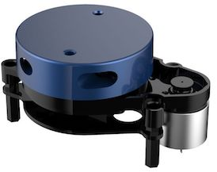

# YDLidar X2 Python library
Open the serial port of the YDLidar X2, and parse the data packets to extract measures.



# Sample usage
```python
from LidarX2 import LidarX2
import time

lidar = LidarX2("/dev/cu.SLAB_USBtoUART")  # Name of the serial port, can be /dev/tty*, COM*, etc.

if not lidar.open():
    print("Cannot open lidar")
    exit(1)

t = time.time()
while time.time() - t < 20:  # Run for 20 seconds
    measures = lidar.getMeasures()  # Get latest lidar measures
    print measures
    time.sleep(0.01)

lidar.close()
```

# YDLidar Windows Application to Display Sensor Data

* [YDLidar Tool for the X2](https://www.ydlidar.com/dowfile.html?cid=6&type=5)
* [X2 User Manual](https://www.ydlidar.com/dowfile.html?cid=6&type=2)
